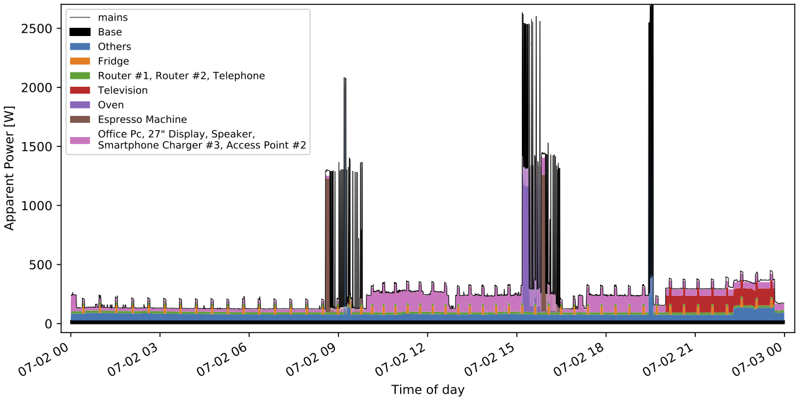
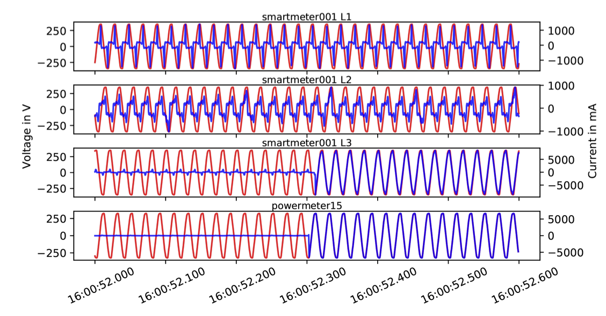

# The Fully-labeled hIgh-fRequencyElectricity Disaggregation (FIRED) dataset

Python module to load and interact with the FIRED dataset. 
The files contain scripts to generate several statistics and plots from the data.

# Dataset Info

- voltage and current wave-forms of a three-room apartment in Germany 
- 32 days of recording
- 21 individual appliance readings at 2kHz
- aggregated readings from appartment's mains at 8kHz
- data stored in matroska multimedia container as audio stream
- additional sensor readings (temp, hum), lighting states (on/of, dimm, color) and device information available
- 50Hz and 1Hz data summary with derived active, reactive and apparent power readings available 
- 99.98% data availability (missing data filled with zeros to maintain timestamps)


## Download

Use the ``rsync``command to download the data. The password is: *nobodyGetsFIRED*

You can download the complete dataset (that's a whoopy 1.2TB) using rsync:
```bash
rsync -avzh --progress rsync://FIRED@clu.informatik.uni-freiburg.de/FIRED/  <DESTINATION> [--dry-run]
```

If you are only interested in the summary files (28GB) use:
```bash
rsync -avzh --progress --exclude="highFreq" rsync://FIRED@clu.informatik.uni-freiburg.de/FIRED/  <DESTINATION> [--dry-run]
```

If you want typical Smart Meter data, you can download only the 1Hz data (1GB):
```bash
rsync -avzh --progress --exclude="highFreq" --exclude="summary/50Hz" rsync://FIRED@clu.informatik.uni-freiburg.de/FIRED/  <DESTINATION> [--dry-run]
```

## Sample Data

An example of one day of electricity consumption can be seen below. By estimating the base power during night times, the aggregated power matches the sum of the base power and the indivdual appliance data. 


The data richness of the raw data stream can be seen in the following figure. Raw data is sampled at 8kHz for the SmartMeter and 2kHz for the individual appliance data.

## Installation

Required python packages: numpy, pandas, scipy, json and pyav.
To install ```pyav```:
```bash
git clone https://github.com/pscholl/PyAV.git
cd PyAv
git checkout origin/phil
python3 setup.py install
```

## How to Use

The helper module makes using the dataset a breeze.
```python
import helper as hp

# load 1Hz power data of the television for complete recording range
television = hp.getPower("television", 1)

# load 50Hz power data of powermeter09 (Fridge) of day 2020.07.02
startTs,  stopTs = hp.getRecordingRange("2020.07.02", "2020.07.03")
fridge = hp.getMeterPower("powermeter09", 50, startTs=startTs, stopTs=end)
```

Plotting the data is straightforward:
```python
import matplotlib.pyplot as plt
import numpy as np
from datetime import datetime

start = fridge["timestamp"]
end = start+(len(fridge["data"])/fridge["samplingrate"])
timestamps = np.linspace(start, end, len(fridge["data"])
dates = [datetime.fromtimestamp(ts) for ts in timestamps]

fig, ax = plt.subplots()
ax.plot(dates, fridge["data"]["p"], label="active power")
ax.plot(dates, fridge["data"]["q"], label="reactive power")

ax.set(xlabel='Time of day', ylabel='Power (W/var)', title='Fridge')
fig.autofmt_xdate()
plt.show()

```

