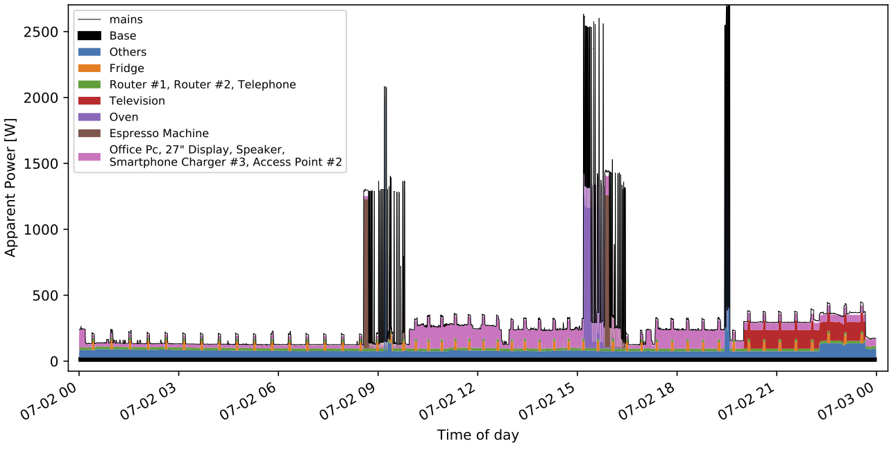
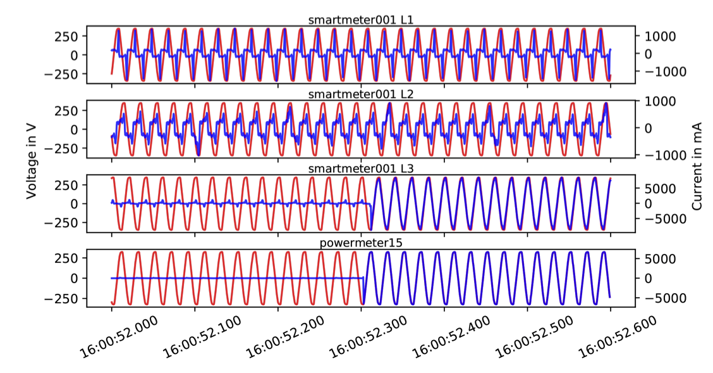
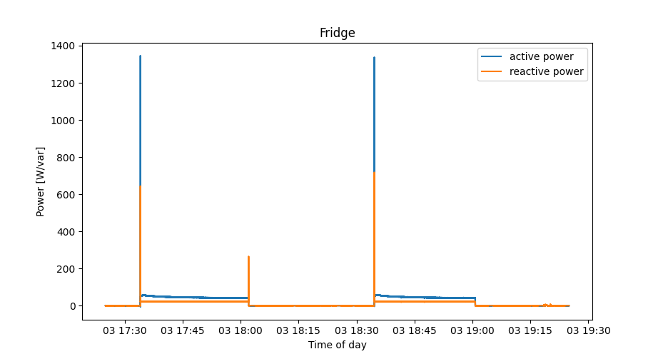

# The Fully-labeled hIgh-fRequency Electricity Disaggregation (FIRED) dataset

Python module to load and interact with the FIRED dataset. 
The files contain scripts to generate several statistics and plots from the data.

# Dataset Info

- voltage and current wave-forms of a three-room apartment in Germany 
- 101 days of recording
- 21 individual appliance readings at 2kHz
- aggregated readings from appartment's mains at 8kHz
- data stored in matroska multimedia container as WavPack encoded audio stream
- additional sensor readings (temp, hum), lighting states (on/of, dimm, color) and device information available
- 50Hz and 1Hz data summary with derived active, reactive and apparent power readings available 
- 99.96% data availability (missing data filled with zeros to maintain timestamps)


## Download

Use the ``rsync``command to download the data. The password is: *nobodyGetsFIRED*

You can download the complete dataset (that's a whoopy 3.2TB) using rsync:
```bash
rsync -avzh --progress rsync://FIRED@clu.informatik.uni-freiburg.de/FIRED/  <DESTINATION> [--dry-run]
```

If you are only interested in the summary files (80GB) use:
```bash
rsync -avzh --progress --exclude="highFreq" rsync://FIRED@clu.informatik.uni-freiburg.de/FIRED/  <DESTINATION> [--dry-run]
```

If you want typical Smart Meter data, you can download only the 1Hz data (1.7GB):
```bash
rsync -avzh --progress --exclude="highFreq" --exclude="summary/50Hz" rsync://FIRED@clu.informatik.uni-freiburg.de/FIRED/  <DESTINATION> [--dry-run]
```

## Online Availability

The 50Hz power data is also available within the [Annoticity tool](https://earth.informatik.uni-freiburg.de/annoticity). 
Annoticty allows to visually inspect and label electricity datasets like FIRED.
You can also use Annoticity to download the 50Hz power file of a particular device in FIRED.

## Sample Data

An example of one day of electricity consumption can be seen below. By estimating the base power during night times, the aggregated power matches the sum of the base power and the indivdual appliance data. 


The data richness of the raw data stream can be seen in the following figure. Raw data is sampled at 8kHz for the SmartMeter and 2kHz for the individual appliance data.


## Measurement Hardware

The DAQ was comprised of a custom-built smart meter (see [SmartMeter](https://github.com/voelkerb/smartmeter)) and 21 distributed plug-level meters (see [PowerMeter](https://github.com/voelkerb/smartmeter)). Both streamed their data over TCP (via WiFi and Ethernet) to a central PC in the network for persistent storage. The data was time synchronized using Real Time Clocks and NTP.  


## Appliances

| Count    | Appliance              | Brand     | Model                          | Watt     |       Meter |
|----------|------------------------|-----------|--------------------------------|---------:|------------:|
| 2        | Light bulb             | IKEA      | TRADFRI E27 \- 980lm           | 12       |             |
| 1        | Light bulb             | IKEA      | TRADFRI E27 \- 806lm           | 8\.9     |             |
| 5        | Light bulb             | IKEA      | TRADFRI E14 \- 400lm           | 5\.3     |             |
| 12       | Light bulb             | IKEA      | TRADFRI GU10 \- 400lm          | 5        |             |
| 1        | Driver                 | IKEA      | TRADFRI Driver                 | 10       |             |
| 2        | Light                  | IKEA      | LINDSHUT                       | 40       |             |
| 1        | Light bulb             | IKEA      | RYET E27 \- 1000lm             | 10       |             |
| 1        | Kitchen Spot Light     | IKEA      | 3x halogen GU4 375lm \+ driver | 40       | 24          |
| 1        | Espresso Machine       | Rocket    | Appartamento                   | 1200     | 15          |
| 1        | Coffee Grinder         | Graef     | Cm800                          | 128      | 13          |
| 1        | Kitchen Machine        | Vorwerk   | Thermomix TM5                  | 500      | 11          |
| 1        | Hand Mixer             | Grundig   | HM5040                         | 300      | 11          |
| 1        | Hand Blender           | Bosh      | MSM6B150                       | 300      | 11          |
| 1        | Waffle Maker           | Cloer     | WAFFELAUTOMAT 1621             | 930      | 11          |
| 1        | Fridge                 | IKEA      | HUTTRA                         | 144kWh/y | 09          |
| 1        | Kettle                 | Aigostar  | Adam 30GOM                     | 2200     | 16          |
| 1        | Toaster                | GRUNDIG   | TA 5040                        | 1000     | 11          |
| 1        | Oven                   | IKEA      | MIRAKULÖS                      | 3480     | 25          |
| 1        | Stove                  | IKEA      | BARMHÄRTIG                     | 5500     |             |
| 1        | Fume Extractor         | IKEA      | WINDIG                         | 250      | 28          |
| 1        | Sewing Machine         | Pfaff     | hobbymatic 919                 | 80       | 11          |
| 1        | Vacuum Cleaner         | Fakir     | S220 electronic                | 1300     | 11          |
| 1        | Baby Heat Lamp         | Reer      | FeelWell                       | 600      | 08          |
| 1        | Hairdryer              | Remington | D3190                          | 2200     | 17          |
| 1        | Iron                   | Philips   | azur EXCEL PLUS 525            | 1960     | 11          |
| 1        | Battery Charger        | SANYO     | MQN04                          | 5        | 11          |
| 1        | Electrical brush       | Oral\-B   | Vitality Cross Action D12\.513 | 5        | 11          |
| 1        | Razor                  | Philips   | SensoTouch Series 7000         | 5\.4     | 11          |
| 1        | Window Cleaner         | Vileda    | Windowmatic POWER              | 4        | 11          |
| 1        | Smart Speaker          | Apple     | HomePod                        | 15       | 14          |
| 1        | Laptop \#1             | Apple     | Macbook Pro 15 A1398           | 85       | 11          |
| 1        | Laptop \#2             | Apple     | Macbook Pro 13 A1708           | 65       | 11          |
| 1        | Office PC              | Apple     | Mac Mini A1993                 | 85       | 20          |
| 1        | Media PC               | Apple     | Mac Mini A1347                 | 85       | 21          |
| 1        | 27” Display            | Apple     | Thunderbolt display            | 200      | 21          |
| 1        | Television             | Samsung   | UE48JU6450                     | 64       | 23          |
| 1        | Hifi System            | Onkyo     | TX\-SR507                      | 160      | 22          |
| 1        | Subwoofer              | Onkyo     | SKW\-501E                      | 105      | 22          |
| 1        | Printer                | EPSON     | Stylus SX435W                  | 15       | 19          |
| 1        | PC Speaker             | Logitech  | Z2300                          | 240      | 20          |
| 1        | Smartphone Charger \#1 | \-        | 2 Port USB                     | 10       | 10          |
| 1        | Smartphone Charger \#2 | \-        | 4 Port USB                     | 20       | 12          |
| 1        | Smartphone Charger \#3 | Apple     | MD813ZM/A                      | 5        | 20          |
| 1        | Telephone              | Gigaset   | A400                           | 1        | 18          |
| 1        | Router \#1             | Apple     | Airport Extreme A1521          | 10\.3    | 18          |
| 1        | Router \#2             | Telekom   | Speedport Smart 1              | 15       | 18          |
| 1        | Router \#3             | Netgear   | R6250                          | 30       | 27          |
| 2        | Access Point \#1, \#2  | Apple     | Airport Express A1264          | 8        |             |
| 1        | Access Point \#3       | Apple     | Airport Express A1392          | 2\.2     | 26          |
| 1        | Recording PC           | Intel     | NUC8v5PNK                      | 60       | 27          |

## The thing with the fridge...

* The installed fridge started to malfunction on June 17th and finally broke down on June 18th.
* A temporary replacement fridge (Bomann KB 340.1) was installed on June 21st.
* The broken fridge was still in its warranty period and a replacement unit (same model) was eventually installed on July 19th.

**The good thing:** Name another electricity dataset out there in which a fridge broke down. You want to test your *predictive maintenance* algorithm?

## Known Issues

Smartmeter Data (current L3) is corrupt every now and then after 08/30/2020 14:00
(we think it is a bad soldering joint or bad connection of the CT)

## Installation

Required python packages: numpy, pandas, scipy, json and pyav.
To install:
```bash
pip install -r requirements.txt
```

## How to Use

The helper module makes using the dataset a breeze.

Setting up the helper: 
```python
import helper as hp

# Set FIRED base Folder (location where you downloaded the dataset)
hp.FIRED_BASE_FOLDER = "~/FIRED"
```

Load data of a particular appliance:
```python
# load 1Hz power data of the television for complete recording range
television = hp.getPower("television", 1)
```
```bash
Out[1]: 
{'samplingrate': 1,
 'samples': 8726400,
 'duration': 8726400.0,
 ...
 'title': 'powermeter23',
 'timestamp': 1592085600.0,
 'measures': ['p', 'q', 's'],
 'phase': 3,
 'data': rec.array([(142.97263  , 51.67106 , 152.02325 ),
            (  0.       ,  0.      ,   0.      ),
            (  0.       ,  0.      ,   0.      ), ...,
            (  0.8029512, 10.034512,  10.066586),
            (  0.511058 ,  9.985003,   9.998074),
            (  0.5797112,  9.834283,   9.851355)],
           dtype=[('p', '<f4'), ('q', '<f4'), ('s', '<f4')]),
 'name': 'television'}
```

Load data of a particular meter over particular time of interest:
```python
# load 2h of 50Hz power data of powermeter09 (Fridge) of day 2020.08.03
startTs, stopTs = hp.getRecordingRange("2020.08.03 17:25:00", "2020.08.03 19:25:00")
fridge = hp.getMeterPower("powermeter09", 50, startTs=startTs, stopTs=stopTs)
```
```bash
Out[2]: 
{'samplingrate': 50,
 'samples': 360000,
 'duration': 7200.0,
 ...
 'title': 'powermeter09',
 'timestamp': 1596468300.0,
 'measures': ['p', 'q', 's'],
 'phase': 3,
 'data': rec.array([(0.71093047, 0.30342358, 0.7729735 ),
            (0.65431005, 0.3545675 , 0.7442041 ),
            (0.683063  , 0.33363467, 0.7601889 ), ...,
            (0.73287123, 0.35243228, 0.81320894),
            (0.5769262 , 0.40467358, 0.7047017 ),
            (0.70400655, 0.42130944, 0.8204431 )],
           dtype=[('p', '<f4'), ('q', '<f4'), ('s', '<f4')])}
```

Plotting the data is straightforward:
```python
import matplotlib.pyplot as plt
import numpy as np
from datetime import datetime
# Construct timestamps
start = fridge["timestamp"]
end = start+(len(fridge["data"])/fridge["samplingrate"])
timestamps = np.linspace(start, end, len(fridge["data"])
dates = [datetime.fromtimestamp(ts) for ts in timestamps]
# Plot data
fig, ax = plt.subplots()
ax.plot(dates, fridge["data"]["p"], label="active power")
ax.plot(dates, fridge["data"]["q"], label="reactive power")
# Format plot
ax.set(xlabel='Time of day', ylabel='Power [W/var]', title='Fridge')
fig.autofmt_xdate()
plt.show()
```


Aggregated data from the SmartMeter can be loaded similiarly:
```python
smartmeter = hp.getMeterPower(hp.getSmartMeter(), 50, startTs=startTs, stopTs=stopTs)
```
```bash
Out[3]: 
[{'samplingrate': 50,
  'samples': 360000,
  'duration': 7200.0,
  'title': 'smartmeter001 L1',
  'timestamp': 1596468300.0,
  'measures': ['p', 'q', 's'],
  'phase': 1,
  'data': ... },
 {'samplingrate': 50,
  'samples': 360000,
  'duration': 7200.0,
  'title': 'smartmeter001 L2',
  'timestamp': 1596468300.0,
  'measures': ['p', 'q', 's'],
  'phase': 2,
  'data': ... },
 {'samplingrate': 50,
  'samples': 360000,
  'duration': 7200.0,
  'title': 'smartmeter001 L3',
  'timestamp': 1596468300.0,
  'measures': ['p', 'q', 's'],
  'phase': 3,
  'data': ... }]
```

Loading high frequency voltage and current data is now also possible without the need to download all the files in advance:
```python
# Data is now loaded on the fly over rsync
hp.RSYNC_ALLOWED = True
# load two seconds of high freq data powermeter09 (Fridge)
startTs, stopTs = hp.getRecordingRange("2020.08.03 17:34:02", "2020.08.03 17:34:04")
fridge = hp.getMeterVI("powermeter09", startTs=startTs, stopTs=stopTs)
```
